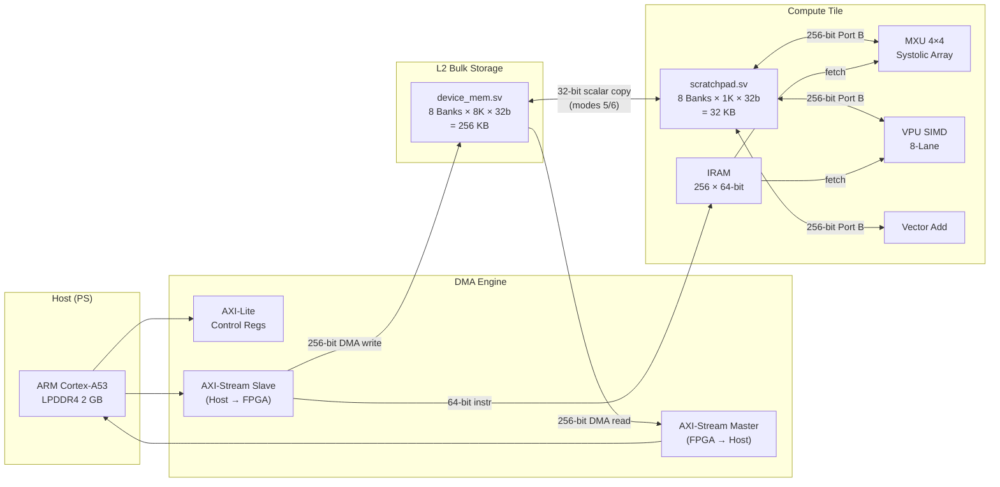

# Optimized Mini-TPU Memory Subsystem (`opt-mem`)

A cleaned, optimized, and benchmarked memory hierarchy for the Cornell Mini-TPU on the **Ultra96-v2** (Xilinx Zynq UltraScale+ ZU3EG). This branch connects AXI-Lite control, AXI DMA streams, AXI4-Full MMIO, 8-bank L2 system BRAM, 8-bank L1 scratchpad, and the TensorCore compute tile into one board-runnable flow with independently controllable DMA and compute channels.

## Contribution

This branch upgrades the baseline `memory-system` design in three phases:

1. **Baseline Repair** — Fixed compute relaunch semantics by correctly resetting the program counter between iterations. Without this fix the baseline appeared artificially slow on repeated benchmarks because only the first launch executed the full program.

2. **8-Bank L1/L2 Memory Hierarchy** — Replaced the scalar memory path with a multi-banked, 256-bit-wide datapath for both the L2 bulk storage and the L1 scratchpad. The VPU now uses 8-lane banked `VLOAD`/`VSTORE`/`VCOMPUTE` instructions instead of scalar element-at-a-time accesses, reducing L1 transactions from 744 to 93 for a 248-element vector operation.

3. **Double Buffering / Overlapped Execution** — Exposed separate `compute_idle` and `dma_idle` status bits and independent DMA/compute wait paths in both hardware and the PYNQ runtime. This lets the host overlap the next tile's DMA transfer with the current tile's compute, achieving measurable 1.54× speedup over serial execution.

### Key Results (vs. corrected baseline)

| Benchmark | Baseline | Optimized | Speedup |
|:----------|:---------|:----------|:--------|
| VADD (2048 words × 128 repeats) | 17.470 ms | 2.473 ms | **7.06×** |
| MXU 4×4 matmul (128 repeats) | 1.315 ms | 0.315 ms | **4.18×** |
| Banked VPU vector add (248 elems) | 1.315 ms | 0.314 ms | **4.18×** |
| Host write (8192 words) | 1.147 ms | 1.000 ms | **1.15×** |
| Host read (8192 words) | 1.309 ms | 1.228 ms | **1.07×** |
| Double buffering (serial → overlap) | 3.474 ms | 2.253 ms | **1.54×** |

---

## Architecture



### Memory Tiers

| Tier | Module | Width | Capacity | Interface |
|:-----|:-------|:------|:---------|:----------|
| Host | LPDDR4 | 64-bit | 2 GB | PYNQ DMA / CMA buffers |
| Interconnect | AXI DMA | 128-bit (at DMA) / 256-bit (internal) | — | AXI-Stream |
| L2 Bulk Storage | `device_mem.sv` | 256-bit (Port A) / 32-bit (Port B) | 256 KB | 8-bank BRAM |
| L1 Scratchpad | `scratchpad.sv` | 256-bit (Port B) / 32-bit (Port A) | 32 KB | 8-bank BRAM |
| IRAM | `compute_tile.sv` | 64-bit | 2 KB (256 entries) | Dual-port BRAM |

### Operating Modes

| Mode | Name | Direction | Description |
|:-----|:-----|:----------|:------------|
| 1 | `DMA_WRITE` | Host → L2 | AXI-Stream bulk write to system memory |
| 2 | `DMA_READ` | L2 → Host | AXI-Stream bulk read from system memory |
| 3 | `COMPUTE` | — | Execute program from IRAM on compute tile |
| 4 | `WRITE_IRAM` | Host → IRAM | Load instruction program via AXI-Stream |
| 5 | `SYS_TO_OC` | L2 → L1 | Scalar copy from bulk storage to scratchpad |
| 6 | `OC_TO_SYS` | L1 → L2 | Scalar copy from scratchpad to bulk storage |

### Dual-Channel Arbiter

The top-level arbiter (`mem_top.sv`) runs two independent FSMs:

- **DMA channel** (modes 1, 2, 4, 5, 6) — controls `fsm_running`, dispatches to `mem_ctrl`
- **Compute channel** (mode 3) — controls `compute_running`, dispatches to `compute_ctrl` → `compute_tile`

Both channels complete independently. The host polls `compute_idle` and `dma_idle` separately, enabling true overlapped execution and double buffering.

---

## Design Files

### System-Level RTL (`src/system/`)

| File | Purpose |
|:-----|:--------|
| [`mem_top.sv`](src/system/mem_top.sv) | **Top-level integration.** Wires all subsystems together, implements the dual-channel doorbell arbiter, muxes the scalar memory port between `mem_ctrl` and AXI-Full. |
| [`mem_ctrl.sv`](src/system/mem_ctrl.sv) | **Memory controller FSM.** Handles DMA write/read handshakes (modes 1/2) and 2-phase scalar copy pipeline for `SYS_TO_OC`/`OC_TO_SYS` (modes 5/6). |
| [`device_mem.sv`](src/system/device_mem.sv) | **8-bank L2 bulk storage.** Instantiates 8 BRAM banks with a 256-bit wide Port A (DMA) and a 32-bit muxed Port B (scalar/MMIO). |
| [`compute_ctrl.sv`](src/system/compute_ctrl.sv) | **Compute controller.** Bridges the arbiter's `compute_start_pulse` to the compute tile's `start`/`done` handshake. |
| [`tpu_slave_axi_lite.v`](src/system/tpu_slave_axi_lite.v) | **AXI-Lite control registers.** Doorbell, mode, addresses, transfer length, and status readback (`compute_idle`, `dma_idle`, `stream_ready`). |
| [`tpu_slave_axi_stream.v`](src/system/tpu_slave_axi_stream.v) | **AXI-Stream slave (DMA write).** Receives 256-bit beats from the DMA engine, tracks the write pointer, asserts `done` on `TLAST`. |
| [`tpu_master_axi_stream.v`](src/system/tpu_master_axi_stream.v) | **AXI-Stream master (DMA read).** Reads from L2 Port A via a FWFT FIFO, sends 256-bit beats to DMA, asserts `TLAST`. |
| [`axi_full_slave.sv`](src/system/axi_full_slave.sv) | **AXI4-Full MMIO.** Direct 32-bit register-style read/write to L2 Port B. Supports burst transactions. |
| [`dma_engine.sv`](src/system/dma_engine.sv) | DMA helper logic. |
| [`fifo4.sv`](src/system/fifo4.sv) | 4-entry FWFT FIFO used by the master stream. |

### Compute Tile RTL (`src/compute_tile/` and `tensorcore/`)

| File | Purpose |
|:-----|:--------|
| [`compute_tile.sv`](src/compute_tile/compute_tile.sv) | **Compute tile wrapper.** Contains scratchpad, IRAM, PC, decoder, and compute core. Exposes Port A (scalar DMA) and Port B (256-bit compute). |
| [`scratchpad.sv`](tensorcore/scratchpad.sv) | **8-bank L1 scratchpad.** Port A: 32-bit scalar for `mem_ctrl` copies. Port B: 256-bit wide for parallel compute access. |
| [`compute_core.sv`](tensorcore/compute_core.sv) | **Compute orchestration.** Arbitrates Port B between MXU, VPU, and VADD based on instruction `mode[1:0]`. |
| [`mxu.sv`](tensorcore/mxu.sv) | **Matrix Multiply Unit.** 4×4 systolic array, 32-bit fixed-point. Reads weight/activation rows from scratchpad, writes output rows back. |
| [`systolic.sv`](tensorcore/systolic.sv) | Systolic array grid of processing elements. |
| [`pe.sv`](tensorcore/pe.sv) | Individual processing element (multiply-accumulate). |
| [`vpu_simd.sv`](tensorcore/vpu_simd.sv) | **8-lane SIMD vector unit.** Banked `VLOAD`/`VSTORE`/`VCOMPUTE` ops that access all 8 scratchpad banks in one cycle. |
| [`vpu_op.sv`](tensorcore/vpu_op.sv) | VPU ALU operations. |
| [`decoder.sv`](tensorcore/decoder.sv) | Instruction decoder — extracts opcode, addresses, VPU fields from 64-bit instruction word. Halt opcode = `0x3FF`. |
| [`pc.sv`](tensorcore/pc.sv) | Program counter with reset support. |
| [`fp32_add.sv`](tensorcore/fp32_add.sv) | FP32 adder. |
| [`fp32_mul.sv`](tensorcore/fp32_mul.sv) | FP32 multiplier. |
| [`vec_regfile.sv`](tensorcore/vec_regfile.sv) | VPU register file. |

### Runtime (`runtime/`)

| File | Purpose |
|:-----|:--------|
| [`pynq_host.py`](runtime/pynq_host.py) | **PYNQ host driver.** `MemDriver` class providing `send_bytes()`, `read_bytes()`, `sysmem_to_onchip()`, `onchip_to_sysmem()`, `load_instructions()`, `run_compute()`, `send_bytes_async()`. Separate `wait_compute_idle()` and `wait_dma_idle()` for double buffering. |

### Board Tests (`board_tests/`)

| File | Purpose |
|:-----|:--------|
| [`test_mem_system.py`](board_tests/test_mem_system.py) | **Functional test suite.** 10 tests covering DMA roundtrips, MMIO, cross-path verification, L2↔L1 copies, and bit-exact patterns. |
| [`test_concurrency.py`](board_tests/test_concurrency.py) | **Concurrency test.** Validates overlapped DMA + compute execution. |

### Benchmarks (`benchmarks/`)

| File | Purpose |
|:-----|:--------|
| [`mem_benchmark.py`](benchmarks/mem_benchmark.py) | **Board benchmark suite.** Measures DMA bandwidth, L1 copy latency, VADD compute, MXU matmul, VPU banked ops, double-buffering overlap. Outputs JSON. |
| [`compare_mem_benchmarks.py`](benchmarks/compare_mem_benchmarks.py) | **A/B comparison tool.** Reads two JSON result files and prints a formatted scorecard with speedup columns. |
| [`run_mem_benchmark_from_checkout.sh`](benchmarks/run_mem_benchmark_from_checkout.sh) | **Checkout runner.** Deploys a specific git checkout's bitstream + runtime to the board and runs the benchmark. |

### Build Scripts (`scripts/`)

| File | Purpose |
|:-----|:--------|
| [`package_mem_ip.tcl`](scripts/package_mem_ip.tcl) | Vivado TCL script to package the memory subsystem as a Vivado IP core. |
| [`build_mem_bitstream.tcl`](scripts/build_mem_bitstream.tcl) | Vivado TCL script to create the block design, connect PS/PL, and run synthesis + implementation + bitstream generation. |

### Documentation (`docs/`)

| File | Purpose |
|:-----|:--------|
| [`system_architecture.md`](docs/system_architecture.md) | High-level block diagram and signal descriptions. |
| [`memory_design.md`](docs/memory_design.md) | Memory hierarchy detail, AXI interfaces, register map, and doorbell protocol. |
| [`MEMORY_SYSTEM.md`](docs/MEMORY_SYSTEM.md) | Compact register/data-path reference. |
| [`test_explanation.md`](docs/test_explanation.md) | Board test descriptions and expected output. |
| [`interactive_memory_flow.html`](docs/interactive_memory_flow.html) | Interactive animated data-flow visualization (open in browser). |

---

## Build & Deploy

### Prerequisites

- Xilinx Vivado 2023.2
- Ultra96-v2 board with PYNQ image
- `sshpass` installed on the build host
- Board accessible via SSH (default: `BOARD_IP=132.236.59.68`)

### Quick Start

```bash
# Source Vivado
source /opt/xilinx/Vitis/2023.2/settings64.sh

# See all available commands
make help

# Package the memory subsystem IP
make mem-ip

# Build the bitstream (includes IP packaging)
make mem-bitstream

# Run board-level functional tests
make mem-board-tests BOARD_IP=<your-board-ip>

# Run the concurrency / double-buffering test
make concurrency-test BOARD_IP=<your-board-ip>

# Run the full benchmark suite
make mem-benchmark BOARD_IP=<your-board-ip> BENCH_ARGS="--repeats 5 --warmups 1"
```

### Makefile Reference

```
make help                  Show all targets and usage
make mem-ip                Package memory subsystem IP (Vivado)
make mem-bitstream         Build block design + bitstream (Vivado)
make mem-board-tests       Deploy and run test_mem_system.py on board
make concurrency-test      Deploy and run test_concurrency.py on board
make mem-benchmark         Deploy and run mem_benchmark.py on board
make tensorcore-ip         Package TensorCore IP standalone
make bitstream             Build full TPU bitstream
make clean                 Remove all build artifacts
```

Build artifacts are written to:

```
ultra96-v2/output/artifacts/mem_bd.bit
ultra96-v2/output/artifacts/mem_bd.hwh
```

---

## Board Tests

The test suite (`board_tests/test_mem_system.py`) validates every data path in the memory hierarchy:

| Test | What It Checks |
|:-----|:---------------|
| `dma_write_read` | 32-word DMA write + readback roundtrip |
| `dma_large_transfer` | 1024-word bulk DMA integrity |
| `dma_offset_addr` | Non-zero address DMA write/read |
| `mmio_write_read` | AXI4-Full MMIO 8-word roundtrip |
| `mmio_random_access` | Scattered single-word MMIO reads/writes |
| `dma_write_mmio_read` | Cross-path: write via DMA, verify via MMIO |
| `mmio_write_dma_read` | Cross-path: write via MMIO, verify via DMA |
| `sys_to_onchip` | L2 → L1 → L2 internal copy roundtrip |
| `onchip_roundtrip` | Full path: Host → L2 → L1 → L2 → Host |
| `bitpattern_deadbeef` | Bit-exact `0xDEADBEEF` pattern verification |

### Running Individual Tests

```bash
make mem-board-tests BOARD_IP=<ip> BOARD_TEST_ARGS="--test dma_write_read --verbose"
make mem-board-tests BOARD_IP=<ip> BOARD_TEST_ARGS="--test onchip --verbose"
make mem-board-tests BOARD_IP=<ip> BOARD_TEST_ARGS="--list"
```

---

## Benchmarks & Reproducing Results

### Run the Strength Benchmark

This is the primary evaluation configuration that produces the published results:

```bash
# Run baseline (Sunwoo's memory-system branch)
bash benchmarks/run_mem_benchmark_from_checkout.sh \
  --checkout ~/minitpu-mem-base \
  --variant mem-base-pc-reset-strength \
  --board-ip <board-ip> \
  --out results/mem-base-pc-reset-strength.json \
  --bench-args "--repeats 5 --warmups 1 --sizes 1024,4096,8192 \
    --copy-sizes 1024,2048,4096 --vadd-len 2048 --vadd-repeats 128 \
    --mxu-repeats 128 --vpu-elems 248 --dma-words 8192"

# Run optimized (this branch)
bash benchmarks/run_mem_benchmark_from_checkout.sh \
  --checkout ~/minitpu/tpu \
  --variant codex-system-mem-strength-fetch-pipeline \
  --board-ip <board-ip> \
  --out results/codex-system-mem-strength-fetch-pipeline.json \
  --bench-args "--repeats 5 --warmups 1 --sizes 1024,4096,8192 \
    --copy-sizes 1024,2048,4096 --vadd-len 2048 --vadd-repeats 128 \
    --mxu-repeats 128 --vpu-elems 248 --dma-words 8192"

# Compare
python3 benchmarks/compare_mem_benchmarks.py \
  results/mem-base-pc-reset-strength.json \
  results/codex-system-mem-strength-fetch-pipeline.json
```

### Quick Smoke Test

```bash
make mem-benchmark BOARD_IP=<ip> BENCH_ARGS="--repeats 1 --warmups 0 --sizes 256,1024 --copy-sizes 256,1024"
```

### Focused Benchmarks

```bash
# MXU-only comparison
bash benchmarks/run_mem_benchmark_from_checkout.sh \
  --checkout ~/minitpu/tpu --variant mxu-test --board-ip <ip> \
  --out results/mxu-test.json \
  --bench-args "--mxu-only --repeats 5 --warmups 1 --mxu-repeats 128"

# Banked VPU comparison
bash benchmarks/run_mem_benchmark_from_checkout.sh \
  --checkout ~/minitpu/tpu --variant vpu-test --board-ip <ip> \
  --out results/vpu-test.json \
  --bench-args "--banked-vpu-only --repeats 5 --warmups 1 --vpu-elems 248"
```

### Understanding the Scorecard

The comparison script outputs a **Strength Scorecard** summarizing the key metrics:

```
Strength Scorecard:
evaluation                            baseline                 candidate                advantage
---------------------------------------------------------------------------------------------------------
Host write bandwidth (8192 words)     1.147, 28.6 MB/s         1.000, 32.8 MB/s         1.15x faster
Host read bandwidth (8192 words)      1.309, 25.0 MB/s         1.228, 26.7 MB/s         1.07x faster
VADD compute (2048 words × 128)       17.470 ms                2.473 ms                 7.06x faster
MXU 4×4 matmul (128 repeats)          1.315 ms                 0.315 ms                 4.18x faster
Candidate double buffering            serial 3.474 ms          overlap 2.253 ms          1.54x faster
8-bank VPU/L1 transaction model       744 transactions         93 transactions          8.00x faster
```

- **speedup > 1.00×** means the candidate (optimized) design has lower median latency
- **MBps_delta > 0** means the candidate has higher median bandwidth
- Skipped rows indicate features not exposed by the baseline driver/design (e.g., double buffering, explicit L1 copy)

---

## Typical Data Flow: Matrix Multiply

```
1. Host writes weight matrix A to L2              (Mode 1: DMA_WRITE)
2. Host writes activation matrix B to L2           (Mode 1: DMA_WRITE)
3. Host writes compute program to IRAM             (Mode 4: WRITE_IRAM)
4. Copy A from L2 → L1 scratchpad                  (Mode 5: SYS_TO_OC)
5. Copy B from L2 → L1 scratchpad                  (Mode 5: SYS_TO_OC)
6. Execute compute program (MXU multiply)           (Mode 3: COMPUTE)
7. Copy result from L1 → L2                         (Mode 6: OC_TO_SYS)
8. Host reads result from L2                        (Mode 2: DMA_READ)
```

With double buffering, steps 1–2 for the *next* tile can overlap with step 6 for the *current* tile.

---

## FPGA Resource Utilization

| Resource | Used | Available | Utilization |
|:---------|:-----|:----------|:------------|
| CLB LUTs | 41,229 | 70,560 | 58.4% |
| CLB Registers | 21,959 | 141,120 | 15.6% |
| Block RAM (36Kb) | 74 | 216 | 34.3% |
| Block RAM (18Kb) | 10 | 432 | 2.3% |
| DSP48E2 | 50 | 360 | 13.9% |

---

## Directory Structure

```
tpu/
├── Makefile                          # Build orchestrator (make help)
├── README.md                         # ← You are here
├── src/
│   ├── system/                       # System-level RTL
│   │   ├── mem_top.sv                #   Top-level integration + arbiter
│   │   ├── mem_ctrl.sv               #   Memory controller FSM
│   │   ├── device_mem.sv             #   8-bank L2 bulk storage
│   │   ├── compute_ctrl.sv           #   Compute controller bridge
│   │   ├── tpu_slave_axi_lite.v      #   AXI-Lite control registers
│   │   ├── tpu_slave_axi_stream.v    #   AXI-Stream slave (DMA write)
│   │   ├── tpu_master_axi_stream.v   #   AXI-Stream master (DMA read)
│   │   ├── axi_full_slave.sv         #   AXI4-Full MMIO interface
│   │   ├── dma_engine.sv             #   DMA helper
│   │   └── fifo4.sv                  #   FWFT FIFO
│   ├── compute_tile/                 # Compute tile wrapper
│   │   └── compute_tile.sv
│   └── l2_tile/                      # L2 tile (future)
├── tensorcore/                       # Compute primitives
│   ├── scratchpad.sv                 #   8-bank L1 scratchpad
│   ├── compute_core.sv              #   MXU + VPU + VADD orchestration
│   ├── mxu.sv                       #   4×4 systolic array
│   ├── vpu_simd.sv                  #   8-lane SIMD vector unit
│   ├── systolic.sv                  #   Systolic grid
│   ├── pe.sv                        #   Processing element
│   ├── decoder.sv                   #   Instruction decoder
│   ├── pc.sv                        #   Program counter
│   ├── fp32_add.sv / fp32_mul.sv    #   FP32 arithmetic
│   └── vec_regfile.sv               #   VPU register file
├── runtime/
│   └── pynq_host.py                 # PYNQ host driver (MemDriver)
├── board_tests/
│   ├── test_mem_system.py           # Functional test suite (10 tests)
│   └── test_concurrency.py          # Overlapped execution test
├── benchmarks/
│   ├── mem_benchmark.py             # Board benchmark suite
│   ├── compare_mem_benchmarks.py    # A/B comparison scorecard
│   └── run_mem_benchmark_from_checkout.sh
├── scripts/
│   ├── package_mem_ip.tcl           # Vivado IP packaging
│   └── build_mem_bitstream.tcl      # Block design + bitstream build
├── results/                          # Benchmark JSON outputs
├── docs/
│   ├── system_architecture.md       # Block diagram
│   ├── memory_design.md            # Memory hierarchy detail
│   ├── MEMORY_SYSTEM.md            # Register/data-path reference
│   ├── test_explanation.md          # Board test notes
│   └── interactive_memory_flow.html # Interactive data-flow visualization
└── ultra96-v2/                      # Target-specific files
    ├── output/artifacts/            #   mem_bd.bit, mem_bd.hwh
    └── ...
```

---

## Interactive Visualization

An animated, interactive visualization of all data paths is available at [`docs/interactive_memory_flow.html`](docs/interactive_memory_flow.html). Open it in any modern browser and click through the operation buttons to watch data packets traverse the architecture.
