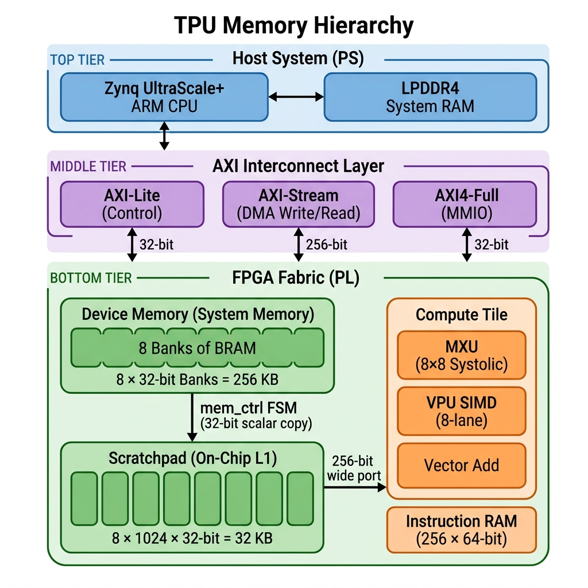
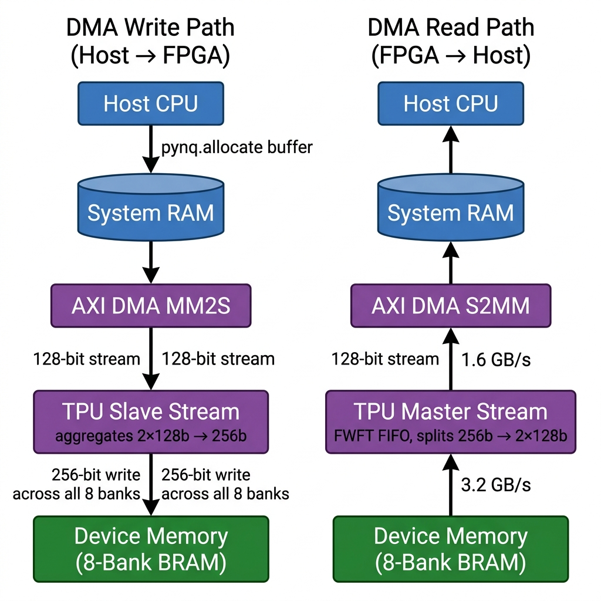
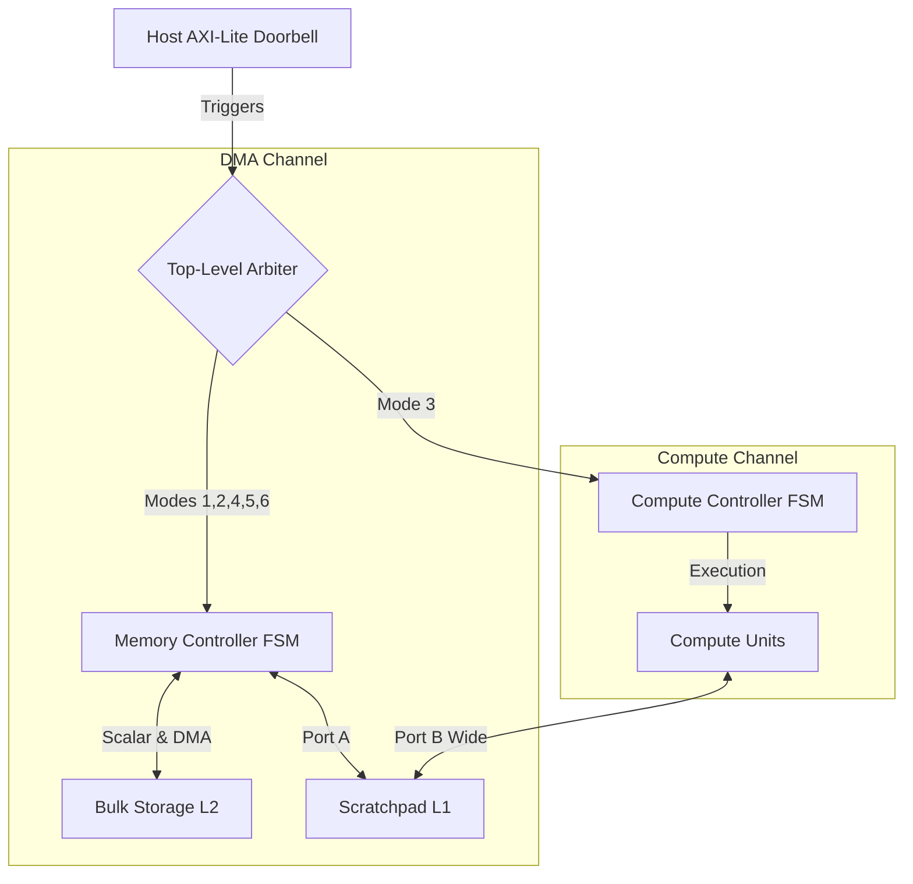
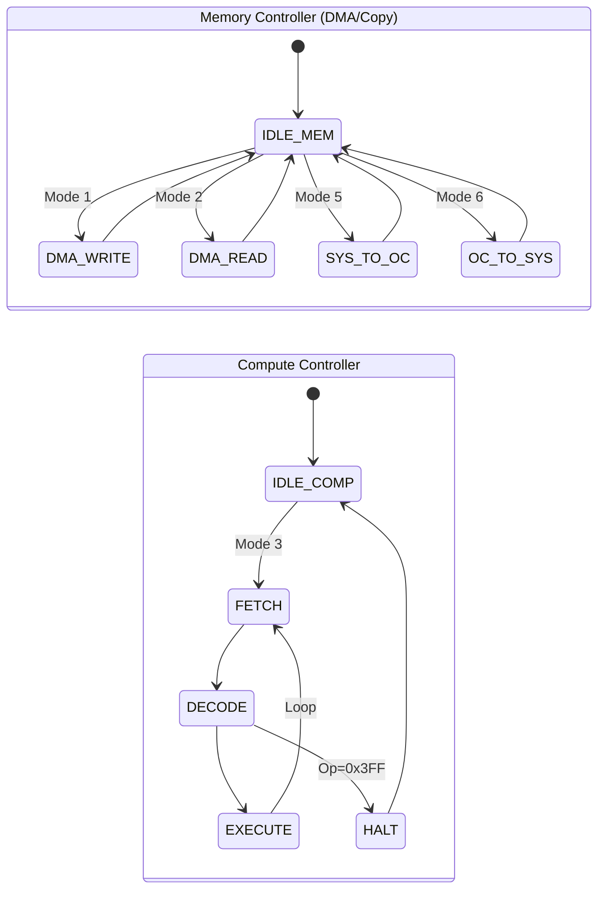
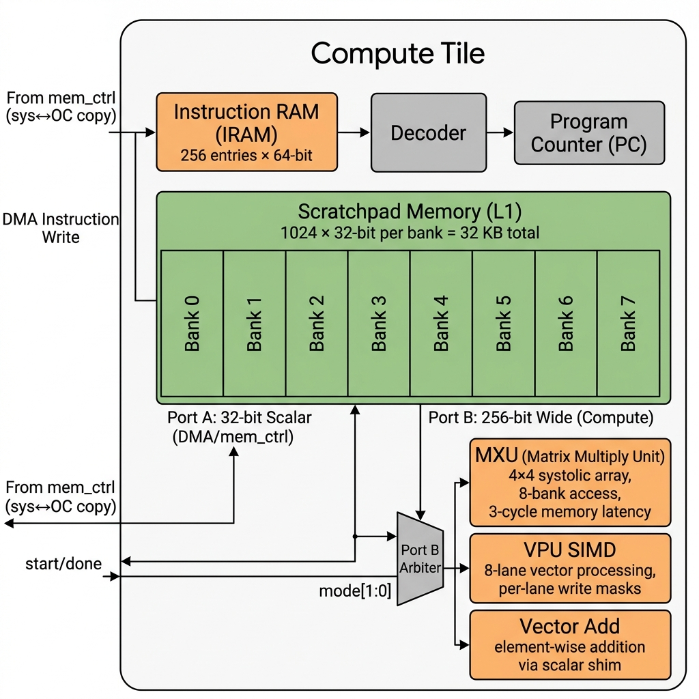

# Mini-TPU Memory Subsystem (`system-mem` branch)

The `system-mem` branch implements the full memory hierarchy for the Cornell Mini-TPU on the **Ultra96-v2** (Xilinx Zynq UltraScale+ ZU3EG). This document explains every level of the memory hierarchy, the data paths between them, and the control mechanisms that orchestrate data movement.

---

## Overall Architecture



The Mini-TPU memory subsystem is organized in three tiers:

| Tier | Component | Width | Capacity | Clock | Peak Throughput |
|:-----|:----------|:------|:---------|:------|:----------------|
| **Host (PS)** | LPDDR4 System RAM | 64-bit | 2 GB | 533 MHz | ~4.2 GB/s |
| **Interconnect** | AXI DMA / Stream | 128-bit | — | 100 MHz | 1.6 GB/s |
| **Bulk Storage (L2 Cache)** | 8-Bank BRAM | 256-bit | 256 KB | 100 MHz | 3.2 GB/s |
| **Scratchpad (L1)** | 8-Bank Interleaved | 256-bit (compute) / 32-bit (scalar) | 32 KB | 100 MHz | 3.2 GB/s |
| **Instruction RAM** | Dual-Port BRAM | 64-bit | 2 KB (256 entries) | 100 MHz | — |

### FPGA Resource Utilization

| Resource | Used | Available | Utilization |
|:---------|:-----|:----------|:------------|
| CLB LUTs | 41,229 | 70,560 | 58.4% |
| CLB Registers | 21,959 | 141,120 | 15.6% |
| Block RAM (36Kb) | 74 | 216 | 34.3% |
| Block RAM (18Kb) | 10 | 432 | 2.3% |
| DSP48E2 | 50 | 360 | 13.9% |

---

## 1. Host Interface Layer

The host communicates with the TPU through three AXI interfaces, all managed by the Zynq PS:

### 1.1 AXI-Lite (Control & Status)
- **Module:** [`tpu_slave_axi_lite.v`](src/system/tpu_slave_axi_lite.v)
- **Bus Width:** 32-bit data, 6-bit address (16 registers)
- **Purpose:** Register-mapped control plane for triggering operations and polling status.

| Register | Offset | Description |
|:---------|:-------|:------------|
| `slv_reg0` | `0x00` | **Doorbell** `[4]` + **Mode** `[3:0]` — write to trigger an operation |
| `slv_reg1` | `0x04` | **Status** — `compute_idle` `[0]`, `dma_idle` `[1]`, `stream_ready` `[2]` |
| `slv_reg3` | `0x0C` | **System Memory Base Address** (word address) |
| `slv_reg4` | `0x10` | **On-Chip Memory Base Address** (word address) |
| `slv_reg6` | `0x18` | **Transfer Length** (in bytes) |

**Doorbell Mechanism:** The host writes `1` to bit `[4]` of `slv_reg0` along with a mode in bits `[3:0]`. The hardware latches the mode, clears the doorbell bit, and begins execution. The host polls `slv_reg1` to wait for completion.

### 1.2 AXI-Stream (DMA Bulk Transfers)
- **Modules:** [`tpu_slave_axi_stream.v`](src/system/tpu_slave_axi_stream.v) (write), [`tpu_master_axi_stream.v`](src/system/tpu_master_axi_stream.v) (read)
- **Bus Width:** 256-bit (internally), 128-bit at the DMA engine boundary
- **Purpose:** High-throughput bulk data transfer between host memory and device memory.

### 1.3 AXI4-Full (Direct MMIO)
- **Module:** [`axi_full_slave.v`](src/system/axi_full_slave.v)
- **Bus Width:** 32-bit data, 18-bit address
- **Purpose:** Direct register-style read/write access to Bulk Storage (L2 Cache) (System Memory) without going through the DMA engine. Supports AXI burst transactions. Used for small, random-access reads/writes.

---

## 2. Bulk Storage (L2 Cache) (System Memory)



- **Module:** [`device_mem.sv`](src/system/device_mem.sv)
- **Architecture:** 8-bank interleaved true dual-port BRAM
- **Capacity:** 8 banks × 8,192 words × 32 bits = **256 KB**
- **Port A (DMA):** 256-bit wide — all 8 banks are read/written simultaneously for maximum DMA throughput
- **Port B (Scalar):** 32-bit wide — bank-selected access for MMIO and `mem_ctrl` scalar copies
- **BRAM Primitive:** `blk_mem_gen_2` (Xilinx Block Memory Generator, 32-bit × 8,192 depth, True Dual-Port)

### How It Works

Bulk Storage (L2 Cache) serves as the staging buffer between the host and the compute tile. Data flows in via DMA and is later copied to the scratchpad for computation.

**Write path:** The DMA stream writes 256-bit words across all 8 banks in parallel using Port A. The `dma_write_pointer` from the stream slave module provides the sequential address.

**Read path:** The master stream reads 256-bit words from Port A using the `dma_read_pointer`. A FWFT FIFO inside the master stream module buffers data before sending it over AXI-Stream.

**Scalar access (Port B):** This port is muxed between:
- **AXI4-Full slave** — for direct MMIO from the host
- **Memory Controller** — for `sys↔onchip` copy operations (modes 5/6)

The mux is controlled by `mc_owns_scalar`, which gives priority to `mem_ctrl` when the FSM is actively performing a copy.

### Banking Scheme

```
Address bits:  [15:3] = BRAM row address (shared across all banks)
               [2:0]  = Bank select (for 32-bit scalar Port B access)

Port A (DMA):  All banks read/written in parallel at the same row address
Port B (Scalar): Only the selected bank is accessed per cycle
```


### Double Buffering and Concurrency

The Mini-TPU memory subsystem supports concurrent execution of DMA data transfers and compute operations. By utilizing **double buffering** techniques, the host can effectively hide memory transfer latency:



Because the memory subsystem separates the DMA AXI-Stream channel from the internal `sys↔onchip` scalar copy channel, these independent data paths can be fully overlapped. This allows continuous, uninterrupted compute execution.

#### Dual FSM Architecture

The concurrency is driven by two independent state machines running in parallel within `mem_top`. The host can trigger DMA operations and compute operations independently, and poll their completion status separately (`dma_idle` and `compute_idle`).



1. **Ping-Pong Buffering in Scratchpad (L1):** 
   While the compute tile is actively executing operations on data located in the first half of the Scratchpad (L1), the memory controller (`mem_ctrl`) can concurrently copy the next batch of data from the Bulk Storage (L2 Cache) into the second half of the Scratchpad.
2. **Ping-Pong Buffering in Bulk Storage (L2):** 
   Similarly, while `mem_ctrl` is busy copying data between the Bulk Storage and the Scratchpad, the host can simultaneously use the AXI DMA engine to stream new data from LPDDR4 System RAM directly into a different address region of the Bulk Storage.

---

## 3. Memory Controller FSM

- **Module:** [`mem_ctrl.sv`](src/system/mem_ctrl.sv)
- **Purpose:** Orchestrates all non-compute data movement operations

### Supported Modes

| Mode | Name | Direction | Mechanism |
|:-----|:-----|:----------|:----------|
| 1 | `DMA_WRITE` | Host → Bulk Storage (L2 Cache) | AXI-Stream slave receives 256-bit beats |
| 2 | `DMA_READ` | Bulk Storage (L2 Cache) → Host | AXI-Stream master sends 256-bit beats |
| 5 | `SYS_TO_OC` | Bulk Storage (L2 Cache) → Scratchpad | 32-bit scalar copy via Port B → Port A |
| 6 | `OC_TO_SYS` | Scratchpad → Bulk Storage (L2 Cache) | 32-bit scalar copy via Port A → Port B |

### FSM State Diagram

```
                    ┌──────────┐
        start ──────►  S_IDLE  │
                    └────┬─────┘
                         │
              ┌──────────┼──────────┬──────────┐
              ▼          ▼          ▼          ▼
        ┌───────────┐ ┌──────────┐ ┌─────────┐ ┌─────────┐
        │S_DMA_WRITE│ │S_DMA_READ│ │S_SYS2OC │ │S_OC2SYS │
        │           │ │          │ │  _RD     │ │  _RD    │
        └─────┬─────┘ └────┬─────┘ └────┬────┘ └────┬────┘
              │             │            │           │
         write_bram_done  read_bram_done │           │
              │             │        ┌───▼───┐  ┌───▼───┐
              │             │        │S_SYS2OC│  │S_OC2SYS│
              │             │        │  _WR   │  │  _WR  │
              │             │        └───┬────┘  └───┬───┘
              │             │            │           │
              └──────┬──────┴────────────┴───────────┘
                     ▼
                   done → S_IDLE
```

### Scalar Copy Timing (Modes 5/6)

The `sys↔onchip` copy uses a 2-phase pipeline per word to handle BRAM read latency:

1. **Phase 1 (Read):** Assert address + enable on the source memory port. Wait one cycle for BRAM latency.
2. **Phase 2 (Write):** Capture the read data and write it to the destination memory port. Increment word counter.

This results in **2 cycles per 32-bit word** for inter-memory copies.

---

## 4. Compute Tile



- **Module:** [`compute_tile.sv`](src/compute_tile/compute_tile.sv)
- **Contains:** Scratchpad + Compute Core + Decoder + PC + IRAM

The compute tile is a self-contained processing unit that fetches instructions from its local IRAM, decodes them, and dispatches them to one of three execution units. All execution units operate on data stored in the scratchpad.

### 4.1 Scratchpad Memory (L1 On-Chip)

- **Module:** [`scratchpad.sv`](tensorcore/scratchpad.sv)
- **Architecture:** 8-bank interleaved, dual-port
- **Capacity:** 8 banks × 1,024 words × 32 bits = **32 KB**
- **BRAM Primitive:** `mem_wrapper` (synthesized from `blk_mem_gen_0`)

#### Dual-Port Access

| Port | Width | Purpose | Used By |
|:-----|:------|:--------|:--------|
| **Port A** | 32-bit scalar | DMA / `mem_ctrl` scalar copies | `mem_ctrl` (modes 5/6) |
| **Port B** | 256-bit wide (8 × 32-bit) | Parallel compute access | MXU, VPU, Vector Add |

**Port A Banking:** Uses address bits `[2:0]` for bank selection. Only one bank is active per cycle. Read data is returned via a registered mux (1-cycle latency).

**Port B Wide Access:** All 8 banks are addressed by the same row address (`addr[12:3]`). Each bank has an independent write-enable, allowing per-lane masking from the VPU.

### 4.2 Instruction RAM (IRAM)

- **Capacity:** 256 entries × 64-bit = **2 KB**
- **BRAM Primitive:** `blk_mem_gen_1` (True Dual-Port)
- **Port A:** DMA write port — instructions are loaded from the host via mode 4
- **Port B:** PC fetch port — the program counter reads the next instruction each cycle

### 4.3 Instruction Pipeline

```
  FETCH ──► DECODE ──► EXECUTE ──► (wait for done) ──► FETCH
                          │
                  ┌───────┼───────┐
                  ▼       ▼       ▼
                 VPU    MXU    VADD
```

1. **FETCH:** PC presents address to IRAM Port B. Wait 1 cycle for BRAM latency.
2. **DECODE:** Decoder extracts opcode, addresses, mode, and VPU fields from the 64-bit instruction word. If opcode is `0x3FF`, the program halts.
3. **EXECUTE:** Based on `mode[1:0]`, one of three units is kicked:
   - `00` → VPU SIMD
   - `01` → MXU (Systolic Array)
   - `10` → Vector Add
4. **WAIT:** The tile waits for the dispatched unit's `done` signal, then increments PC and returns to FETCH.

### 4.4 Compute Core

- **Module:** [`compute_core.sv`](tensorcore/compute_core.sv)
- **Contains:** MXU, VPU SIMD, Vector Add, Port B Arbiter

#### Matrix Multiply Unit (MXU)
- 4×4 systolic array operating on 32-bit fixed-point values
- Reads weight matrix (A) and input matrix (B) from scratchpad via the 256-bit wide port
- Writes output matrix back to scratchpad
- 3-cycle memory latency model
- Uses all 8 write-enable bits (full-row writes)

#### VPU SIMD
- 8-lane vector processing unit
- Supports per-lane write masks for selective updates
- Operates on 256-bit vectors (8 × 32-bit elements)
- Instruction fields: `vpu_type`, `vreg_dst`, `vreg_a`, `vreg_b`, `vpu_opcode`

#### Vector Add
- Element-wise vector addition
- Accesses scratchpad through a scalar-to-wide shim that maps 32-bit accesses to the banked 256-bit interface

#### Port B Arbiter
The `compute_core` module arbitrates scratchpad Port B access based on the current instruction's `mode[1:0]`:

```
mode = 00 → VPU  controls  {addr, din, en, we}
mode = 01 → MXU  controls  {addr, din, en, we}
mode = 10 → VADD controls  {addr, din, en, we}
```

Read data (`bram_dout_b`) is broadcast to all three units simultaneously.

---

## 5. Top-Level Integration (`mem_top.sv`)

- **Module:** [`mem_top.sv`](src/system/mem_top.sv)
- **Purpose:** Wires together all subsystems and implements the arbiter FSM

### Operating Modes

| Mode | Name | What Happens |
|:-----|:-----|:-------------|
| 0 | IDLE | No operation |
| 1 | DMA_WRITE | Host → Bulk Storage (L2 Cache) via AXI-Stream |
| 2 | DMA_READ | Bulk Storage (L2 Cache) → Host via AXI-Stream |
| 3 | COMPUTE | Execute program from IRAM on compute tile |
| 4 | WRITE_IRAM | Host → Instruction RAM via AXI-Stream |
| 5 | SYS_TO_OC | Bulk Storage (L2 Cache) → Scratchpad (32-bit copy) |
| 6 | OC_TO_SYS | Scratchpad → Bulk Storage (L2 Cache) (32-bit copy) |

### Arbiter FSM

`mem_top` contains a two-channel arbiter:

- **DMA channel** (modes 1, 2, 4, 5, 6): Controls `fsm_running` and dispatches to `mem_ctrl`.
- **Compute channel** (mode 3): Controls `compute_running` and dispatches to `compute_ctrl` → `compute_tile`.

Both channels can complete independently. The host polls `dma_idle` and `compute_idle` status bits in `slv_reg1`.

---

## 6. Typical Data Flow: Matrix Multiply

A complete matrix multiplication involves these steps:

```
1. Host writes weight matrix A to Bulk Storage (L2 Cache)        (Mode 1: DMA_WRITE)
2. Host writes input matrix B to Bulk Storage (L2 Cache)          (Mode 1: DMA_WRITE)
3. Host writes compute program to IRAM                  (Mode 4: WRITE_IRAM)
4. Copy A from Bulk Storage (L2 Cache) → Scratchpad               (Mode 5: SYS_TO_OC)
5. Copy B from Bulk Storage (L2 Cache) → Scratchpad               (Mode 5: SYS_TO_OC)
6. Execute compute program (MXU multiply)               (Mode 3: COMPUTE)
7. Copy result from Scratchpad → Bulk Storage (L2 Cache)          (Mode 6: OC_TO_SYS)
8. Host reads result from Bulk Storage (L2 Cache)                  (Mode 2: DMA_READ)
```

---

## 7. Build & Test

### Prerequisites
- Xilinx Vivado 2023.2
- Ultra96-v2 board with PYNQ image
- `sshpass` for board deployment

### Build Commands

```bash
# Source Vivado environment
source /opt/xilinx/Vitis/2023.2/settings64.sh

# Package the memory subsystem IP
make mem-ip

# Build the bitstream
make mem-bitstream

# Run board-level tests
make mem-board-tests
```

### Test Suite

The board tests (`board_tests/test_mem_system.py`) validate:

| Test | Description |
|:-----|:------------|
| `mmio_write_read` | AXI4-Full MMIO write + readback |
| `mmio_random_access` | Random address MMIO verification |
| `dma_write_read` | DMA round-trip (write → read → verify) |
| `sys_to_onchip` | Bulk Storage (L2 Cache) → Scratchpad copy + verify |
| `onchip_roundtrip` | Full sys→OC→sys round-trip |
| `bitpattern_deadbeef` | Stress test with `0xDEADBEEF` pattern |

---

## Directory Structure

```
tpu/
├── src/
│   ├── system/              # System-level RTL
│   │   ├── mem_top.sv       # Top-level integration
│   │   ├── mem_ctrl.sv      # Memory controller FSM
│   │   ├── device_mem.sv    # 8-bank device memory
│   │   ├── tpu_slave_axi_lite.v    # AXI-Lite control registers
│   │   ├── tpu_slave_axi_stream.v  # AXI-Stream slave (DMA write)
│   │   ├── tpu_master_axi_stream.v # AXI-Stream master (DMA read)
│   │   └── axi_full_slave.v        # AXI4-Full MMIO interface
│   ├── compute_tile/        # Compute tile wrapper
│   │   └── compute_tile.sv
│   └── l2_tile/             # L2 tile (stub)
├── tensorcore/              # Compute primitives
│   ├── scratchpad.sv        # 8-bank scratchpad (L1)
│   ├── compute_core.sv      # MXU + VPU + VADD orchestration
│   ├── mxu.sv               # Systolic array
│   ├── vpu_simd.sv          # SIMD vector unit
│   └── ...
├── runtime/
│   └── pynq_host.py         # PYNQ host driver
├── board_tests/
│   └── test_mem_system.py   # Board-level test suite
├── docs/
│   ├── images/
│   │   ├── memory_hierarchy_overview.png
│   │   ├── dma_data_flow.png
│   │   └── compute_tile_detail.png
│   ├── interactive_memory_flow.html # Interactive visualizer
│   └── MEMORY_SYSTEM.md     # Performance specs
└── Makefile                  # Build orchestrator
```

---

## 8. Interactive Visualization

An interactive, animated visualization of the memory system data flow is available in the repository. It illustrates the physical movement of data through the architecture during the different DMA and copy operations.

To view the interactive visualization:
1. Open [`docs/interactive_memory_flow.html`](docs/interactive_memory_flow.html) in any modern web browser.
2. Use the left-hand control panel to click through the different operations (DMA Write, Sys to On-Chip, Compute, On-Chip to Sys, and DMA Read).
3. Watch the animated data packets traverse the correct architectural paths.
