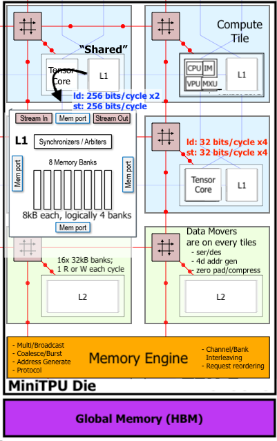

# TPU Hardware

This directory contains the source code, verification and build infrastructure for the Mini-TPU hardware.

### Architecture


## Project Structure
- src
   - compute_tile/
   - system/
- Makefile
- scripts/
- verification/
    - compute_tile/
    - system/

## Build Flow

The FPGA build flow packages the portable TensorCore RTL into a Vivado IP, then builds a board-specific block design and bitstream.
```bash
make compute_tile-ip    # package compute tile as IP
make tpu-ip            # package tpu as IP
make bitstream         # build bitstream
make tpu               # build tpu hardware by programming FPGA
```

### Build Outputs

Artifacts are located in `build/artifacts/`:

| File | Description |
|------|-------------|
| `minitpu.bit` | FPGA bitstream |
| `minitpu.hwh` | Hardware handoff for PYNQ |
| `utilization_report.txt` | Resource usage summary |
| `timing_summary.txt` | Timing analysis |
| `power_report.txt` | Power estimates |

**Typical utilization (xczu3eg):**
- LUTs: ~24%
- Registers: ~8%
- DSPs: 34 (for FP32 multiply)
- Clock: 50 MHz (WNS ~3ns positive slack)


## RTL Architecture (TensorCore)

The TensorCore is the heart of the TPU, implemented in portable SystemVerilog.

### RTL Module Hierarchy

```
                                ┌──────────────────────────────────────────────┐
                                │             tpu.sv (Top Level)               │
                                │                                              │
                                │  ├─ AXI-Lite Slave (Control Registers)       │
                                │  ├─ AXI-Stream Slave (DMA Input)             │
                                │  ├─ AXI-Stream Master (DMA Output)           │
                                │  ├─ TODO: separate interface for host & DDR  │
                                │  │                                           │
                                │  └─ compute_tile.sv (Logic Wrapper)          │
                                │     ├─ tensorcore.sv (Controller)            │
                                │     │  ├─ pc.sv                              │
                                │     │  ├─ decoder.sv                         │
                                │     │  ├─ blk_mem_gen_1 (I-BRAM)             │
                                │     │  ├─ mxu.sv (Systolic Array)            │
                                │     │  └─ vpu_simd.sv (Vector ALU)           │
                                │     ├─ scratchpad.sv (Data BRAM)             │
                                │     └─ TODO: router.sv                       │
                                └──────────────────────────────────────────────┘
```

### Core Components

- **TensorCore (`tensorcore.sv`)**: Central controller; includes PC, Decoder, and Instruction BRAM.
- **Compute Tile (`compute_tile.sv`)**: Wrapper for TensorCore and Scratchpad memory, providing a unified DMA interface.
- **Matrix Unit (`mxu.sv`)**: 4×4 weight-stationary systolic array.
- **SIMD Unit (`vpu_simd.sv`)**: Vector processing unit for element-wise operations (ReLU, etc.).

### Data Flow

```
                    ┌──────────────────────────────────────────────────┐
   Input (64-bit)   │                  COMPUTE PATH                     │   Output (32-bit)
   ────────────────►│                                                   │────────────────►
                    │  ┌─────────┐   ┌─────────────┐   ┌─────────────┐ │
   Instructions     │  │ BRAM    │──►│  Systolic   │──►│   Output    │ │
   ────────────────►│  │ (Data/  │   │   Array     │   │   Buffer    │ │
                    │  │ Weight) │   │   (4×4)     │   │             │ │
                    │  └─────────┘   └─────────────┘   └─────────────┘ │
                    │       │                              ▲           │
                    │       ▼                              │           │
                    │  ┌─────────────────────────────────┐ │           │
                    │  │            VPU                  │─┘           │
                    │  │  (ReLU, Element-wise ops)       │             │
                    │  └─────────────────────────────────┘             │
                    └──────────────────────────────────────────────────┘
```

---

## System Integration (Ultra96-v2)

For FPGA deployment, the TensorCore is wrapped in AXI interfaces and integrated into a Zynq UltraScale+ system.

### System Architecture

```
┌─────────────────────────────────────────────────────────────────┐
│                      Zynq UltraScale+ MPSoC                     │
│  ┌──────────────────────────────────────────────────────────┐   │
│  │                    Processing System                      │   │
│  │                                                           │   │
│  │   M_AXI_HPM0_FPD ─────┐          ┌───── S_AXI_HP0_FPD    │   │
│  │                        │          │                       │   │
│  │   PL_CLK0 ────────────┼──────────┼───────                 │   │
│  │   PL_RESETN0 ─────────┼──────────┼───────                 │   │
│  └──────────────────────┼──────────┼────────────────────────┘   │
└─────────────────────────┼──────────┼────────────────────────────┘
                          │          │
                          ▼          ▲
              ┌───────────────────────────────┐
              │       AXI Interconnect        │
              │        (Control Path)         │
              └───────┬─────────────┬─────────┘
                      │             │
            ┌─────────▼───┐   ┌─────▼─────────┐
            │  AXI DMA    │   │  Mini-TPU     │
            │ (Control)   │   │   (S00_AXI)   │
            └─────────────┘   └───────────────┘
                  │                   ▲
    ┌─────────────┴───────────────────┴──────────┐
    │              AXI SmartConnect               │
    │              (Memory Access)                │
    └────────────────────┬────────────────────────┘
                         │ (to PS HP0)
```

### IP Interfaces

The packaged TPU IP exposes:

| Interface | Type | Width | Description |
|-----------|------|-------|-------------|
| `S00_AXI` | AXI4-Lite Slave | 32-bit data, 6-bit addr | Control registers |
| `S00_AXIS` | AXI-Stream Slave | 64-bit | Input data stream (Instructions/Weights/Data) |
| `M00_AXIS` | AXI-Stream Master | 32-bit | Output data stream |

---

---

## Verification

The Mini-TPU uses a multi-level verification strategy combining SystemVerilog unit tests and cycle-accurate Cocotb integration tests.

### 1. Unit Testing (Compute Tile)
Portable unit tests for the core logic (MXU, SIMD, Scratchpad).
```bash
make -C tpu/verification/compute_tile all
```

### 2. System-Level Simulation (RTL)
Integration tests that verify AXI-Lite control and AXI-Stream DMA paths using **Icarus Verilog** and **Cocotb**.
```bash
make -C tpu/verification/system test_data_integrity_rtl
```

**Current Verification Status:**
- ✅ **Compute Tile Unit Tests**: Passing.
- ⏳ **System RTL Simulation**: Functional, but under investigation.
  - *Known Issue*: A 1-element data shift persists in DMA read-back.
  - *Mitigation*: Simulation currently uses a behavioral BRAM model with 3-cycle read latency to match hardware assumptions.

---

## Hardware Targets

| Target | Status | Notes |
|--------|--------|-------|
| `ultra96-v2` | ✅ Supported | Zynq UltraScale+ MPSoC flow (Vivado) |
| `alveo-u280` | ⏳ Planned | Vitis/XRT flow to be added |

---