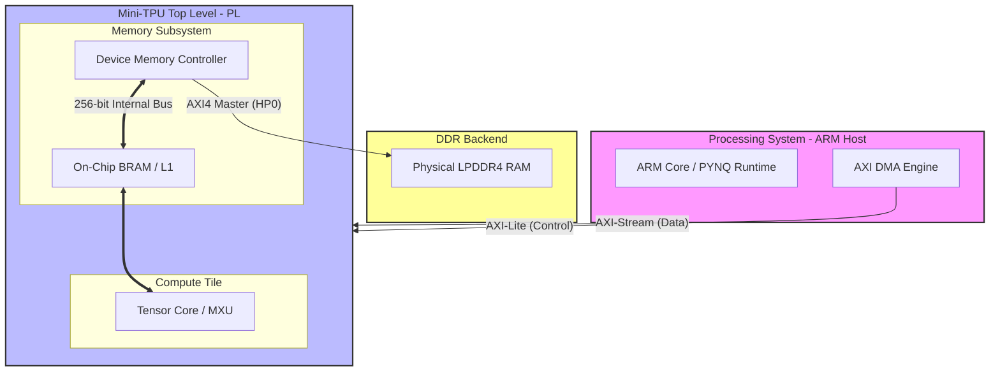

# Mini-TPU System Architecture

This document provides a high-level overview of the Mini-TPU system architecture, including the interconnect, compute tiles, and memory hierarchy.

## Block Diagram

The Mini-TPU follows a tile-based architecture organized around a unified memory subsystem. The current implementation on the Ultra96-v2 platform integrates the host PS with a high-bandwidth PL memory controller.

## Key Components

- **Tensor Core (MXU):** The primary systolic array for matrix multiplication. It operates directly on 256-bit wide data vectors from the On-Chip memory.
- **On-Chip BRAM (L1):** Fast, low-latency scratchpad memory implemented in PL BRAM. It provides data-level parallelism for the compute tile.
- **Device Memory Controller (DMC):** A high-performance AXI4 Master FSM that bridges the internal TPU bus to physical LPDDR4 memory.
- **CMA Workspace Buffer:** A 1MB physically contiguous memory buffer allocated in the PS and passed to the TPU DMC via an AXI-Lite register (`slv_reg10`) to provide safe isolation from Linux kernel memory space.
- **AXI-Lite Interface:** 32-bit control port for register configuration, mode selection, and doorbell triggers.
- **AXI-Stream DMA Path:** Dedicated high-throughput path for host-to-device bulk data movement.
- **LPDDR4 Storage:** Physical system memory on the Ultra96-v2 board, acting as the primary storage for large datasets (L2/System Memory).

## Connectivity & Protocols

- **AXI-Lite (S_AXI):** Decoupled write FSM ensures 100% protocol compliance for control register access.
- **AXI-Stream (S_AXIS/M_AXIS):** Synchronous data streaming between PYNQ and the PL memory controller.
- **AXI4-Master (M_AXI):** 128-bit/256-bit burst-capable interface connecting the TPU directly to the Zynq PS HP0 port for DDR access.
- **Cache Coherency:** Managed by the PS (ARMv8) and enforced by the driver using explicit cache maintenance operations (sync/invalidate).
