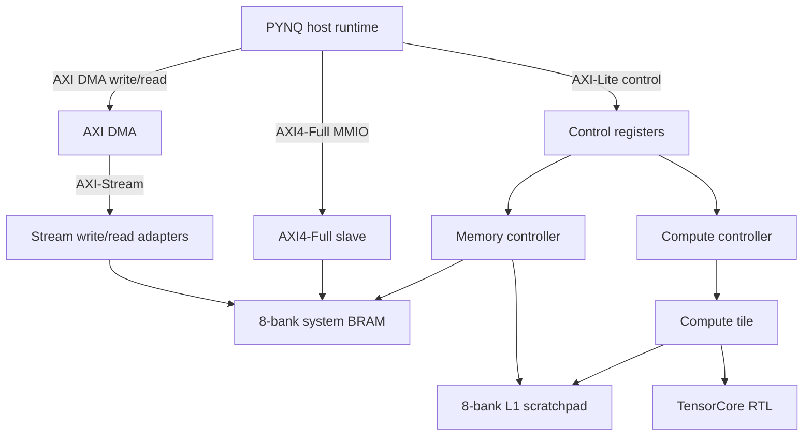

# System Architecture

The cleaned `opt-mem` branch contains one hardware target: the optimized
Ultra96-v2 memory subsystem and compute tile integration.



## Main Blocks

- `src/system/mem_top.sv`: top-level integration of control, DMA, MMIO, memory,
  copy, and compute launch logic.
- `src/system/mem_ctrl.sv`: DMA/copy FSM for system-memory and L1 movement.
- `src/system/device_mem.sv`: 8-bank system memory with wide DMA and scalar
  access ports.
- `src/compute_tile/compute_tile.sv`: instruction RAM, scratchpad connection,
  and TensorCore wrapper.
- `tensorcore/`: MXU, VPU, scratchpad, decoder, PC, and arithmetic units.
- `runtime/pynq_host.py`: host API used by board tests and benchmarks.

## Build Output

`make mem-bitstream` generates:

```text
ultra96-v2/output/artifacts/mem_bd.bit
ultra96-v2/output/artifacts/mem_bd.hwh
```
